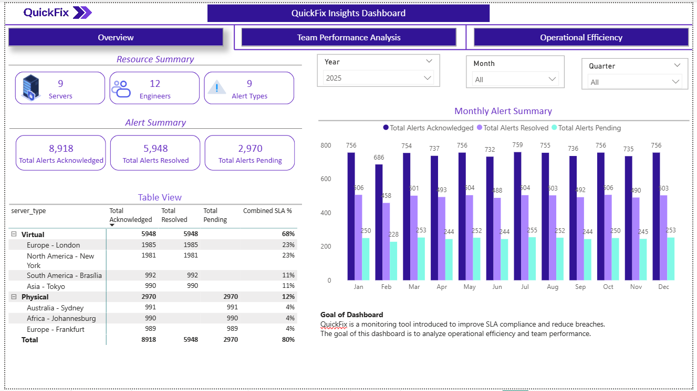

# Quickfix-Insights-Dashboard
Designed and developed the Quickfix Insights Dashboard in Power BI Desktop to analyze team performance and operational efficiency in handling server alerts over a one‑year period. The dashboard provides actionable insights into alert volumes, response times, resolution effectiveness.

## Project Overview
This project analyzes team performance and operational efficiency in handling server alerts using Power BI over a one-year period.

In the existing environment, server alerts were frequently missed or not handled efficiently by the admin team, resulting in SLA breaches. To address this, a 6-month trial (Q3–Q4) of the QuickFix monitoring tool was introduced, along with the formation of a dedicated FLD monitoring team.

The analysis focuses on comparing two phases:
- First 6 months (Q1–Q2): Without QuickFix monitoring tool  
- Next 6 months (Q3–Q4): With QuickFix monitoring tool and FLD team  

The dashboard evaluates the impact of the QuickFix implementation on alert handling, SLA compliance, team performance, and overall operational efficiency.

## Problem Statement
Response and resolution of server alerts were frequently delayed, leading to SLA breaches and reduced system reliability. There was limited visibility into alert trends, engineer performance, and response efficiency.

Following the introduction of the QuickFix monitoring tool and a dedicated monitoring team, the objective is to evaluate whether the solution improves performance and supports a decision on permanent adoption.

## Solution
An interactive Power BI dashboard was developed to monitor SLA performance, alert trends, and team efficiency.

The solution includes ETL processes using Power Query, structured data modeling, and DAX-based calculations to generate actionable insights. The dashboard enables comparison between pre- and post-implementation phases to support data-driven decision-making.

## Key Features
- SLA performance tracking (Response SLA, Resolution SLA, Pending SLA)  
- SLA Met % vs SLA Breach % analysis  
- MTTA (Mean Time to Acknowledge) and MTTR (Mean Time to Resolve) tracking  
- Alert acknowledgment and resolution trend analysis  
- Engineer performance ranking  
- Dynamic filtering and drill-down capabilities  

## Tech Stack
The dashboard was built using the following tools and technologies:

- Power BI Desktop – Data visualization and report development  
- Power Query – ETL layer for data cleaning and transformation  
- DAX (Data Analysis Expressions) – Measures for SLA %, ranking, and KPIs  
- Data Modeling – Star schema with fact and dimension tables  
- File Formats – `.pbix` (development), `.png` (dashboard previews), `.csv` (data source)  

Note: Data is currently sourced from CSV files. For scalability, the solution can be extended to use SQL Server or a data warehouse to handle larger datasets and support enterprise-level ETL workflows.

## Data Source
The dataset used in this project simulates enterprise monitoring data collected over a one-year period.

- Source: Internal monitoring system (simulated dataset for project use)  
- Data includes:
  - Alert ID and timestamps (created, acknowledged, resolved)  
  - SLA status (Met / Breach)  
  - Engineer and server details  
  - Alert categories and priority levels  

Data was cleaned, transformed, and modeled using Power Query before visualization.

## Data Model
A star schema data model was implemented:

- Fact Table: `fact_alerts`  
- Dimension Tables:
  - `dim_engineers`  
  - `dim_severity`  
  - `dim_servers`  
  - `dim_alert_types`  
  - `dim_status`  
  - `dim_date`  

This structure improves performance and enables efficient filtering and aggregation.

## Dashboard Preview

## Project Status
This project is currently in development. Core data modeling and initial dashboard visuals have been implemented, and further enhancements are in progress.

## Key Learnings
- Implemented ETL processes using Power Query  
- Applied DAX for business logic and KPI calculations  
- Designed scalable data models using star schema  
- Improved understanding of SLA-driven analytics and operational monitoring  
